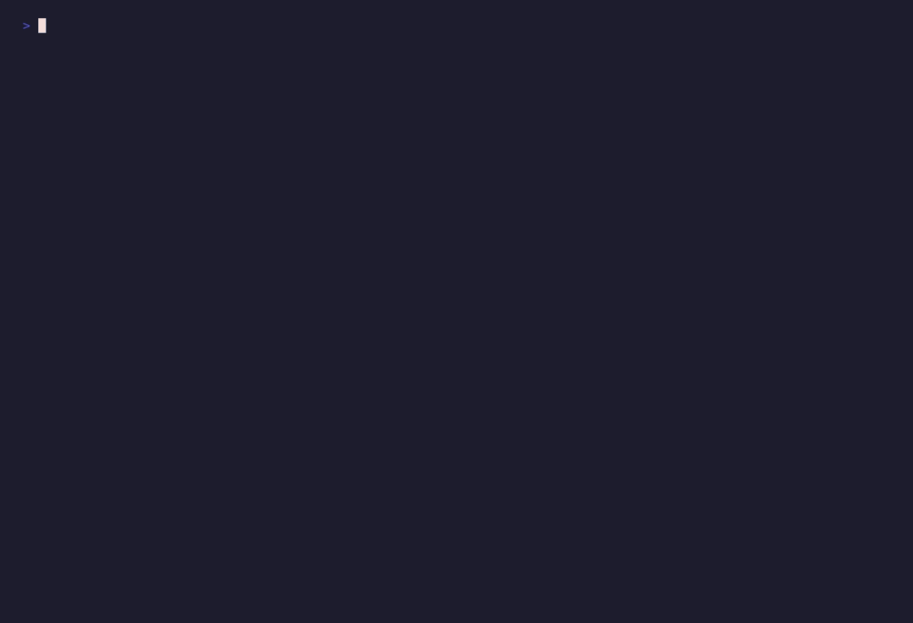

# qr

A lightweight, idiomatic, **pure-Zig** QR code **library** — encode, render,
and decode — with an official **command-line tool** built on top of it. No C
libraries, no external runtime dependencies.

Use it two ways: depend on the `qr` module from your own Zig project (see
[Use as a library](#use-as-a-library)), or install the `qr` binary and generate
codes from the shell.



> Status: the encoder works end-to-end. It produces spec-correct, scannable QR
> codes with **optimal mixed-mode segmentation** (numeric / alphanumeric / byte),
> **ECI / UTF-8** declaration, **versions 1–40**, all EC levels — verified
> module-for-module against the `qrcode` reference library across every mode,
> version, and mask. A **symbol decoder** (matrix → text, with Reed-Solomon error
> correction) round-trips every generated code; `qr decode` reads the `ascii`,
> `pbm`, and `png` formats (auto-detected). Kanji mode is deferred; a full image
> front-end (binarization, finder detection, perspective) and structured append
> are future directions.

## Scope (v1)

- **Generate, display, and decode.** Encoding is complete; the decoder recovers
  text from a module matrix parsed from our `ascii`, `pbm`, or `png` output — no
  image binarization / finder detection for arbitrary photos yet.
- **Numeric, alphanumeric, and byte/UTF-8 modes** with optimal mixed-mode
  segmentation — the input is split into the cheapest sequence of segments (e.g.
  a digit run inside prose is encoded as its own numeric segment).
- **ECI** support: a UTF-8 declaration (ECI 26) is emitted automatically for
  non-ASCII input (override with `--utf8` / `--eci N` / `--no-eci`).
- Versions 1–40, all four EC levels (L/M/Q/H).
- **Renderers:** terminal (Unicode half-blocks), SVG, PNG, ASCII, Netpbm PBM.
- Target **Zig 0.16.0**.

## Benchmarks

Pure Zig with zero dependencies — encoding and decoding are fast and the binary
is tiny. Measured with `zig build bench` (ReleaseFast, single-threaded), with
allocations served from a reset-per-iteration arena:

| Payload                     | Symbol | Encode¹ | Decode² |
| --------------------------- | ------ | ------- | ------- |
| `HELLO`                     | v1     | ~62 µs  | ~4 µs   |
| `https://ziglang.org/learn/overview/` | v3 | ~177 µs | ~14 µs  |

| Binary size (`-Doptimize=ReleaseSmall`) | Dependencies |
| --------------------------------------- | ------------ |
| ~204 KiB (static musl)                  | **0**        |

¹ Encode is text → masked matrix, including automatic version choice and
**evaluating all 8 mask patterns** with penalty scoring (the dominant cost).
² Decode is the realistic `qr decode` path: parse a rendered symbol back into a
matrix, then recover the text with Reed-Solomon correction.

Numbers are a snapshot from one machine — reproduce (and see your own) with:

```sh
zig build bench
```

## Install

Download a prebuilt binary for your platform from the
[Releases](https://github.com/smytheb/qr-zig/releases) page, verify it, and put
it on your `PATH`:

```sh
# pick the asset for your platform, e.g. x86_64-linux-musl
tar -xzf qr-x86_64-linux-musl.tar.gz
sha256sum -c SHA256SUMS                 # optional: verify the checksum
sudo install qr-x86_64-linux-musl/qr /usr/local/bin/
```

The Linux binaries are statically linked (musl), so they have no runtime
dependencies. Or build from source with Zig 0.16.0:

```sh
zig build -Doptimize=ReleaseSafe        # binary at zig-out/bin/qr
```

## Build & run

```sh
zig build                 # build the `qr` binary into zig-out/bin/
zig build run -- help     # run with arguments
zig build test            # run the unit test suite

qr gen "https://ziglang.org"                 # half-block QR in the terminal
echo -n "https://ziglang.org" | qr gen       # read text from stdin
qr gen "hi" --format svg -o code.svg         # write an SVG file
qr gen "hi" --format ascii | qr decode       # encode then decode back to "hi"
qr decode -v code.txt                         # decode a file; -v prints metadata
qr info                                       # capacity table per version/EC
```

**Which format scans?** `terminal` (default) renders square, scannable
half-blocks in any terminal theme; `svg`, `png`, and `pbm` are scannable image
files (`png` is compressed via the standard library's zlib — no third-party deps).
`ascii` is one character per module for piping/debugging — text cells aren't
square, so it is not reliably scannable. `--invert` produces a photo-negative
for dark displays (scanners that support inverted codes, including iOS).

> Zig must be installed (0.16.0). The project pins `minimum_zig_version` in
> `build.zig.zon`. If the first `zig build` reports a `fingerprint` mismatch,
> copy the value it prints into `build.zig.zon`.

## Use as a library

The encoder, renderers, and decoder are published as a single `qr` module that
your project can depend on. Add it to your `build.zig.zon`:

```sh
zig fetch --save git+https://github.com/smytheb/qr-zig
```

Then wire the module into your build graph in `build.zig`:

```zig
const qr = b.dependency("qr", .{
    .target = target,
    .optimize = optimize,
}).module("qr");
exe.root_module.addImport("qr", qr);
```

Now `@import("qr")` gives you the whole pipeline. The public surface:

- `qr.generate(allocator, text, level, eci)` → `Generated` (`.matrix` + metadata;
  call `.deinit()`). Also `generateWithMask` and `generateUnmasked`.
- `qr.render.{terminal, svg, png, pbm, ascii}` — each a `render(writer, &matrix,
  options)`.
- `qr.matrix_input.parse` + `qr.decode.decodeMatrix` — recover text from a
  rendered symbol.
- Types: `qr.EcLevel`, `qr.Matrix`, `qr.Generated`, `qr.Eci`; low-level encoder
  submodules (`qr.encode`, `qr.segment`, `qr.tables`, …) are exposed too.

**Encode and render to SVG** (`examples/encode_svg.zig`):

```zig
const qr = @import("qr");

var code = try qr.generate(allocator, "https://ziglang.org", .m, .auto);
defer code.deinit();
try qr.render.svg.render(writer, &code.matrix, .{ .quiet = 4, .scale = 8 });
```

**Round-trip: encode, render, decode back** (`examples/decode_roundtrip.zig`):

```zig
const qr = @import("qr");

var code = try qr.generate(allocator, "Hello, Zig!", .m, .auto);
defer code.deinit();

var grid: std.Io.Writer.Allocating = .init(allocator);
defer grid.deinit();
try qr.render.ascii.render(&grid.writer, &code.matrix, .{ .quiet = 2 });

var parsed = try qr.matrix_input.parse(allocator, grid.written());
defer parsed.deinit();
const decoded = try qr.decode.decodeMatrix(allocator, &parsed); // -> "Hello, Zig!"
```

Both snippets live in `examples/` as runnable programs; `zig build examples`
compiles and runs them, so they stay in sync with the API.

## Layout

```
src/
  root.zig            library module root: re-exports encode + render + decode
  main.zig            official CLI: argument dispatch, arena-per-command;
                      a consumer of the `qr` module like any downstream project
  qr/
    root.zig          encoder namespace (re-exported by src/root.zig)
    galois.zig        GF(256) arithmetic (comptime exp/log tables)   
    reed_solomon.zig  RS encode + decode (syndrome/BM/Chien/Forney)  
    bitstream.zig     MSB-first bit writer + reader                  
    segment.zig       optimal mixed-mode segmentation (DP)            
    encode.zig        numeric/alphanumeric/byte + ECI encode/decode  
    tables.zig        v1-40 capacity + block structure               
    matrix.zig        function patterns + zigzag data placement      
    mask.zig          8 masks + penalty scoring                      
    format_info.zig   format/version BCH info                        
    generate.zig      encode -> interleave -> matrix -> mask          
  render/
    ascii.zig         '#'/space matrix                              
    terminal.zig      Unicode half-blocks + ANSI (scannable)        
    svg.zig           vector, run-merged rects                      
    pbm.zig           Netpbm P1 bitmap                              
    png.zig           8-bit grayscale, std zlib-compressed          
  decode/
    reader.zig        matrix -> codewords (reverse zigzag, RS fix)  
    matrix_input.zig  parse ascii/pbm/png rendering into a matrix   
    decode.zig        readFormat -> unmask -> read -> segments
examples/
  encode_svg.zig      generate a code and render it as SVG
  decode_roundtrip.zig encode -> render -> decode back to text       
```

## Verifying output

Encoder correctness is checked against an independent reference encoder used
**only for testing** (not linked, not a runtime dep); the decoder is checked by
round-tripping every generated symbol back to its text (including injected
error correction). The Python
`qrcode` library is a deterministic oracle — the test compares the full module
matrix, which is stronger than a scan:

```sh
qr gen "Hello, World!" --format ascii --quiet 0   # compare module-for-module
python3 -c "import qrcode; ..."                    # vs qrcode.get_matrix()
```

The encoder is verified this way across versions 1–40, all EC levels, and all
eight masks — run it yourself:

```sh
zig build && python3 scripts/oracle_check.py    # needs: pip install qrcode
```

A golden fixture in `zig build test` also locks in a verified matrix so the Zig
suite needs no Python.

## Demo

The terminal recording at the top of this README is generated from
[`demo.tape`](demo.tape) with [VHS](https://github.com/charmbracelet/vhs). 

## Roadmap

0. Scaffold (build, CLI skeleton) — **done**
1. Galois field + Reed-Solomon — **done**
2. Byte-mode data encoding + capacity tables — **done**
3. Matrix assembly (finders, timing, alignment, zigzag placement) — **done**
4. Masking + format/version info → scannable code — **done** (oracle-verified)
5. Renderers (terminal / SVG / PNG / PBM / ASCII) — **done**
6. CLI polish (stdin, `-o`, `info`, clean errors) — **done**
7. Validation harness (`scripts/oracle_check.py`, golden test) — **done**
8. Growth: versions 11–40 **done**, numeric/alphanumeric modes **done**,
   optimal mixed-mode segmentation **done**, ECI/UTF-8 **done**, native PNG
   **done**; 
9. Decoder: symbol decode (matrix → text, RS correction) + `qr decode` for the
   ascii / pbm / png formats — **done**; image front-end (binarization / finder
   detection / perspective for arbitrary photos) — **todo**. Structured
   append — **todo**.
10. Micro QR Code (M1–M4): the compact symbology with its own version sizes,
    encoding modes, format info, and masking — **todo** (encode + decode + a
    `--micro` CLI flag).
    
## References

- [ISO/IEC 18004:2015](https://www.iso.org/standard/62021.html) — the QR Code
  symbology standard this implementation targets.
- [qrcode.com](https://www.qrcode.com/en/) — DENSO WAVE's official QR Code site
  ([standards index](https://www.qrcode.com/en/about/standards.html)).

## Trademark

"QR Code" is a registered trademark of
[DENSO WAVE INCORPORATED](https://www.denso-wave.com/en/). This is an
independent, unaffiliated implementation of the symbology standardized as
ISO/IEC 18004; it is not endorsed by or associated with DENSO WAVE.